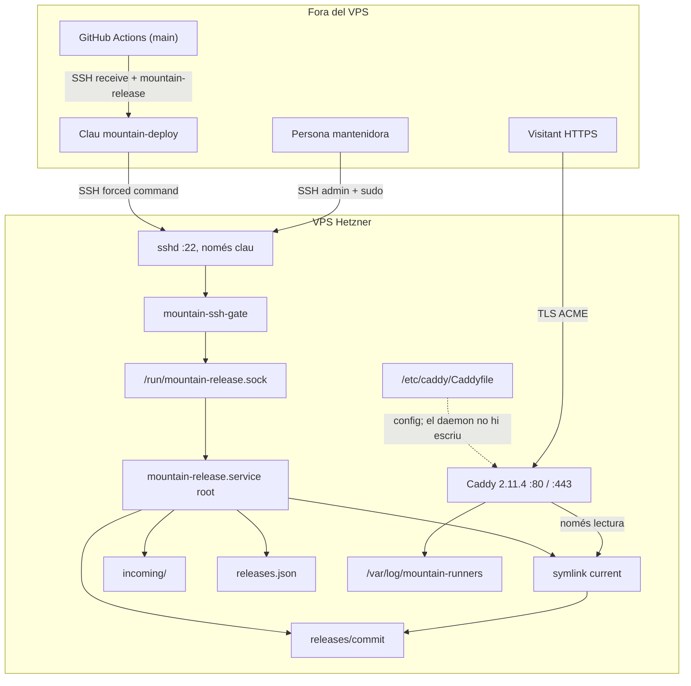

# Runbook De Producció

## Propòsit I Estat

Aquest runbook descriu l'operació mínima de producció de Mountain Runners:
servidor, TLS, logs, salut, desplegament, reversió i resposta a incidències.
Les seccions de servidor, TLS, logs, salut i reversió corresponen a la T5.3 de
[`docs/specs/phase-5-publication-operation.md`](specs/phase-5-publication-operation.md).
Les seccions de desplegament continu i workflow de rollback corresponen a la
T5.4. Les seccions de tall DNS, gate de llançament, HSTS i període
d'observació corresponen a la T5.5.

Cap acció remota (crear el VPS, registres DNS, claus SSH, secrets o activacions)
no s'executa sense l'aprovació explícita de la persona mantenidora. Cap agent,
sessió local ni assistent editorial no pot desplegar ni operar producció.

## Responsables I Canal De Vulnerabilitats

- **Persona mantenidora**: administració del VPS, aprovació del primer tall,
  rollback, revocacions, logs i resposta a incidències (T5.1).
- **Canal privat de vulnerabilitats**: Private Vulnerability Reporting de
  GitHub (`SECURITY.md`), activat i provat el 16 d'agost de 2026 (T5.1).

## 1. Servidor

### Destí

VPS de Hetzner administrat per la persona mantenidora, Debian 12 (o compatible),
amb Caddy 2.11.4 (versió pinjada i checksum SHA-512 verificat al bootstrap) com a
terminador TLS i servidor de la release activa. L'accés SSH és només amb clau
(el bootstrap desactiva l'autenticació per contrasenya); el tallafoc extern de
Hetzner només ha d'obrir 22, 80 i 443.

### Identitats

| Identitat           | Rol                                                                                                                              |
| ------------------- | -------------------------------------------------------------------------------------------------------------------------------- |
| Persona mantenidora | Usuari administratiu no `root` amb `sudo` (accés per SSH amb clau; host key verificat)                                           |
| `mountain-deploy`   | Usuari de sistema amb shell restringit (gate + `receive` a `incoming/`); clau SSH amb `command="mountain-ssh-gate"` i `restrict` |
| Daemon de releases  | Servei systemd com a `root` (`mountain-release.service`); únic escriptor de releases, registre i `current`                       |
| `caddy`             | Usuari del paquet; només llegeix la release activa i escriu els logs                                                             |

La clau de desplegament es fixa a
`/var/lib/mountain-runners/.ssh/authorized_keys` amb `restrict`, sense PTY ni
forwarding. La identitat de desplegament no té cap accés privilegiat al
filesystem ni `sudo`: el gate tokenitza sense shell i envia la petició al daemon
per `/run/mountain-release.sock` (grup `mountain-runners`, mode 0660), que la
revalida i l'executa com a `root`. El daemon tampoc pot escriure la
configuració de Caddy, les claus TLS ni l'estat ACME.

### Arquitectura Del Servidor

Aquest diagrama és la font viva de la configuració del VPS. Actualitza'l al
mateix canvi que toqui identitats, ports, paths, Caddy, el gate, el daemon o el
flux de releases (T5.4 i T5.5 incloses).

El tallafoc de Hetzner només obre 22, 80 i 443. Caddy escolta 80/443, termina
TLS amb ACME i serveix el symlink `current`. El host de validació és el bloc
actiu del `Caddyfile` fins al tall; després del tall s'importa
`Caddyfile.production` (apex i `www`). El daemon de releases no escriu Caddy,
claus TLS ni estat ACME.



Operació d'una release (instal·lar o activar) des de la identitat de
desplegament:

```mermaid
sequenceDiagram
  participant Deploy as Clau mountain-deploy
  participant Gate as mountain-ssh-gate
  participant Daemon as mountain-release
  participant FS as /var/lib/mountain-runners
  participant Caddy as Caddy

  Deploy->>Gate: SSH receive (stdin) / mountain-release
  Note over Gate: tokenitza sense shell; receive escriu incoming/
  Gate->>Daemon: Unix socket
  Note over Daemon: revalida arguments com a root
  Daemon->>FS: install / activate / rollback / revoke
  Caddy->>FS: serveix current
```

### Estructura

```text
/var/lib/mountain-runners/         755  root:root
├── releases/<commit>/             755  root:root (una release per commit)
├── incoming/                      2770 root:mountain-runners (uploads)
├── current                        symlink atòmic a la release activa (root)
├── releases.json                  600  root:root (registre permanent)
└── .ssh/authorized_keys           644  root:root (llegible per sshd-session)
/var/log/mountain-runners/         700  caddy:caddy (accés només via sudo)
/run/mountain-release.sock         660  root:mountain-runners (socket del daemon)
/usr/local/lib/mountain-runners/        eines instal·lades pel bootstrap
```

### Bootstrap (provisió inicial)

Requereix aprovació prèvia i el registre DNS del host de validació apuntant al
VPS. Executar com a `root` des del checkout del repositori:

```sh
VALIDATION_HOST=validate.mountainrunners.cat \
DEPLOY_PUBLIC_KEY="ssh-ed25519 AAAA... deploy@ci" \
./tools/server/bootstrap/bootstrap.sh
```

El bootstrap és reproduïble i idempotent: instal·la Caddy pinjat amb checksum
SHA-512 verificat (`checksums.txt` oficial), crea les identitats, el layout,
els directoris de logs, un drop-in systemd perquè Caddy pugui escriure
`/var/log/mountain-runners`, la configuració de Caddy validada, el servei del
daemon de releases i les eines.
Si no es passa `DEPLOY_PUBLIC_KEY`, la clau de desplegament s'afegeix després
manualment amb les mateixes opcions de forced command.

### Verificació Del Host I Accés SSH

1. Confirmar que `https://<host de validació>` respon i que el certificat és
   vàlid.
2. Fixar la identitat del servidor: registrar el fingerprint de la clau pública
   SSH del VPS (p. ex. amb `ssh-keyscan`) a `known_hosts` de les màquines
   autoritzades i verificar-lo cada vegada que canviï.
3. Comprovar permisos: cap identitat diferent de `root` no ha de poder escriure
   `/etc/caddy/`, els certificats, l'estat ACME, `releases.json` ni el symlink
   `current`. El daemon de releases ha d'estar actiu
   (`systemctl status mountain-release`).

### Còpies De Seguretat I Restauració

Hetzner fa còpies automàtiques del disc del VPS (Backups al Cloud Console).
Aquesta és la via de recuperació si es perd el servidor; no substitueix la
reversió interna de releases.

**Abans de servir el host de validació:** activar els backups automàtics del
VPS al Cloud Console de Hetzner (retenció la que ofereixi el producte, com a
mínim una còpia diària).

**Restauració** (aprovació explícita de la persona mantenidora):

1. Al Cloud Console, crear un servidor nou a partir de l'últim backup (o
   reconstruir el VPS des del backup si Hetzner ho ofereix per a aquella
   instància). No s'editen fitxers a mà dins de les releases.
2. Verificar el fingerprint SSH nou o restablert i actualitzar `known_hosts`.
3. Comprovar `systemctl is-active caddy mountain-release`,
   `sudo mountain-release health` i
   `node tools/server/verify/verify-site.mjs --base-url https://<host> --expect-noindex`.
4. Si el backup és anterior a l'última release activa, instal·lar i activar
   l'artefacte aprovat més recent pel canal de T5.4; no reconstruir al
   servidor.

La primera restauració de prova es fa després del bootstrap del VPS, abans del
tall de producció, amb un servidor de prova o un rebuild controlat.

## 2. TLS

- Caddy emet i renova certificats automàticament (Let's Encrypt) per al host de
  validació i, després del tall, per a `mountainrunners.cat` i `www`.
- El certificat de producció només es completa quan els registres DNS apunten
  al VPS; fins llavors l'error log pot mostrar intents ACME fallits (esperat).
- **HSTS**: s'activa únicament després que el tall hagi validat TLS i tots els
  subdominis afectats, sense `includeSubDomains` (decisió T5.1). La directiva
  està comentada a `Caddyfile.production` com
  `# header Strict-Transport-Security "max-age=31536000"`; s'activa
  descomentant-la, validant amb `caddy validate`, reiniciant Caddy i
  revalidant.
- Verificació de TLS: `curl --fail https://<host>/` i comprovació de la data de
  caducitat amb `openssl s_client -servername <host> -connect <host>:443`.
- Els canvis de configuració de Caddy requereixen `systemctl restart caddy`
  (`admin off` desactiva l'API de configuració en temps d'execució).

## 3. Logs

Tres registres, tots al VPS (T5.1):

| Registre | Contingut                                                  | Ubicació                                  | Retenció               |
| -------- | ---------------------------------------------------------- | ----------------------------------------- | ---------------------- |
| Access   | Temps, IP, mètode, path sense query, status, bytes, durada | `/var/log/mountain-runners/access.log`    | 7 dies, rotació diària |
| Error    | Fallades TLS/ACME i errors del servidor                    | `/var/log/mountain-runners/error.log`     | 30 dies                |
| Releases | Commit, digests, dates i estat de cada release             | `/var/lib/mountain-runners/releases.json` | Permanent              |

- La rotació és diària a mitjanit (integració de Caddy) amb compressió gzip.
- Accés exclusivament per `root` via `sudo`; cap credencial ni query string
  sensible no es registra. Caddy sempre afegeix `ts`, `level`, `logger` i
  `msg` als JSON; no es poden filtrar. La resta de camps no aprovats
  (`resp_headers`, `uri`, capçaleres, TLS, etc.) s'esborren.
- Esborrat: eliminar els fitxers de `/var/log/mountain-runners/` (la rotació
  ja n'elimina els antics segons la retenció).

## 4. Salut

Comprovacions locals (com a `root`):

```sh
sudo mountain-release health             # registre, symlink, digests
systemctl is-active mountain-release     # daemon de releases actiu
systemctl is-active caddy                # servei actiu
curl --fail https://<host>/ca/           # resposta TLS + HTTP
```

La identitat de desplegament consulta l'estat a través del gate
(`mountain-release health`), que el daemon resol com a `root`.

Comprovació remota del contracte complet (headers, 404, caché, noindex):

```sh
node tools/server/verify/verify-site.mjs --base-url https://<host> --expect-noindex
```

`mountain-release health` verifica que el registre es pot llegir, que `current`
apunta a una release registrada com a `active` i que els digests de la release
activa coincideixen amb el manifest. Un estat `DEGRADED` requereix revisió
immediata: no s'activa cap release nova fins a resoldre'l.

## 5. Releases I Reversió

### Instal·lació I Activació

L'artefacte i el manifest els genera el workflow `Artifact` (T5.2). El job de
desplegament (T5.4) els transfereix amb `mountain-release receive` a
`incoming/` i els instal·la. La persona mantenidora pot fer el mateix a mà:

```sh
sudo mountain-release install <arxiu.tar.gz> <manifest.json>
sudo mountain-release activate <commit>
```

La identitat de desplegament executa les mateixes operacions a través del gate
SSH (forçat al daemon), que tokenitza sense shell. El daemon valida tots els
arguments i no permet cap altra ordena. `install` rebutja paths absoluts,
`..`, symlinks, hardlinks, dispositius, fitxers duplicats, qualsevol tipus
inesperat i qualsevol arxiu que superi els límits aprovats (128 MiB expandits,
5.000 entrades, arxiu comprimit màxim 256 MiB); verifica tots els digests
contra el manifest i, en cas de fallada, elimina la release incompleta sense
tocar el punter actiu. `activate` canvia el symlink `current` de manera
atòmica (rename) després de verificar digests i elegibilitat.

### Reversió Rutinària (Interna)

Sense tocar DNS, s'activa la release anterior elegible més recent:

```sh
sudo mountain-release rollback            # release anterior elegible
sudo mountain-release rollback <commit>   # release elegible concreta
```

La reversió verifica elegibilitat i digests i rebutja releases revocades. Si el
workflow de desplegament ha quedat inconsistent amb el registre, `activate` és
idempotent i reconvergeix l'estat.

### Revocació

```sh
sudo mountain-release revoke <commit> --reason "vulnerabilitat X"
```

Motius aprovats: vulnerabilitat, retirada de consentiment, contingut incorrecte
o incidència legal. La release activa no es pot revocar: primer s'activa o es
reverteix a una altra. Les releases revocades no es poden reactivar mai.

### Reversió DNS Inicial (Via Extraordinària)

Si no queda cap release elegible i s'ha d'aturar el servei de la release
activa, la resposta d'emergència (secció 6) és la via prevista. La restauració
dels registres web anteriors de Hostinger queda només com a via extraordinària:
requereix l'exportació prèvia al tall (T5.5), aprovació explícita de la persona
mantenidora i no es pot executar automàticament.

## 6. Resposta D'Emergència (Sense Cap Release Elegible)

Quan `mountain-release rollback` informa que no queda cap release elegible
(codi 3), la resposta d'emergència és la següent:

1. **Registrar l'incident**: causa, releases implicades i motius de revocació
   (el registre de releases és permanent i traçable).
2. **Avaluar la release activa**: si `mountain-release health` està OK, el lloc
   continua servint la release activa; no es retira res més.
3. **Preparar una correcció pel canal aprovat**: PR revisada i fusionada a
   `main` → el workflow d'artefacte genera un artefacte nou → `install` i
   `activate`. Aquesta és l'única via de recuperació: no es reconstrueix al
   servidor, no s'editen fitxers manualment dins de la release, no es reactiva
   cap artefacte revocat i no s'altera el registre a mà.
4. **Si cal retirar la web de servei mentre es prepara la correcció**: decisió
   de la persona mantenidora amb aprovació explícita; documentar l'estat al
   registre de releases i al canal de vulnerabilitats.
5. **Via extraordinària**: la restauració dels registres web anteriors a
   Hostinger (secció 5) només s'executa amb aprovació explícita i registre de
   la decisió.

Prohibicions permanents: reconstruir al servidor, editar fitxers de la release
a mà, reactivar una release revocada i editar `releases.json` manualment.

## 7. Desplegament Continu Des De `main`

El workflow `Artifact` construeix i valida l'artefacte (T5.2) i, al mateix run,
el job `Deploy to production` transfereix **el mateix** paquet al VPS. El job
de build no té `environment` ni secrets de producció. Només el job de
desplegament llegeix els secrets de l'entorn `production`.

### Entorn GitHub `production`

La persona mantenidora crea l'entorn (Settings → Environments) **abans** de la
primera activació. Configuració requerida, sense valors secrets en aquest
document:

| Control             | Valor                                                                          |
| ------------------- | ------------------------------------------------------------------------------ |
| Nom                 | `production`                                                                   |
| Deployment branches | només `main`                                                                   |
| Required reviewers  | la persona mantenidora, fins que la secció 12 registri el període d'observació |
| Wait timer          | 0                                                                              |

Variables d'entorn (Settings → Environments → `production` → Environment
variables):

| Nom                    | Contingut                                                                                         |
| ---------------------- | ------------------------------------------------------------------------------------------------- |
| `DEPLOY_HOST`          | hostname SSH del VPS (host de validació fins al tall; després pot continuar sent la IP o el host) |
| `DEPLOY_USER`          | `mountain-deploy` (opcional; aquest és el valor per defecte)                                      |
| `SMOKE_BASE_URL`       | `https://<host de validació>` fins al tall; `https://mountainrunners.cat` després                 |
| `SMOKE_EXPECT_NOINDEX` | buit o qualsevol valor distint de `false` al host de validació; `false` després del tall          |

Secrets d'entorn:

| Nom                      | Contingut                                            |
| ------------------------ | ---------------------------------------------------- |
| `DEPLOY_SSH_PRIVATE_KEY` | clau privada de la identitat `mountain-deploy`       |
| `DEPLOY_KNOWN_HOSTS`     | línia `known_hosts` amb el fingerprint SSH verificat |

Aquests secrets no es comparteixen amb previews (fase 6) ni amb el job de
build. El workflow no desplega des de forks ni des de branques diferents de
`main`.

La primera execució queda a l'espera de l'aprovació de l'entorn. No s'aprova
fins que el VPS estigui bootstrapjat, la clau de desplegament instal·lada i el
host de validació resolgui. Cap agent ni sessió local no configura l'entorn ni
n'aprova el desplegament.

### Flux

1. Push (o `workflow_dispatch`) a `main` → jobs `build` i `reproducibility`
   sense secrets.
2. El job `deploy` espera l'aprovació de `production` i ocupa el grup de
   concurrència `production-release` (`cancel-in-progress: false`).
3. `tools/deploy/deploy.mjs` comprova que `github.sha` encara és el HEAD de
   `main`; si no, rebutja l'execució (no és una reversió).
4. Verifica el manifest i l'arxiu localment (commit, origen, llista de
   fitxers).
5. Transfereix l'arxiu i el manifest amb `mountain-release receive` (stdin
   per SSH; `restrict` impedeix scp/sftp) i comprova el SHA-256 retornat.
6. `install` (extracció segura al servidor) i, immediatament abans d'activar,
   torna a comprovar el HEAD de `main`.
7. Llegeix el commit actiu actual i fa `activate` (symlink atòmic). Una
   fallada abans d'aquest pas no mou el punter actiu.
8. Torna a comprovar el HEAD de `main`, després `health` i smoke tests
   (`tools/server/verify/verify-site.mjs` amb `--expect-noindex` mentre el
   host de validació és el destí, o `--expect-indexable` quan
   `SMOKE_EXPECT_NOINDEX` és `false`). Si fallen, restaura el commit que era
   actiu abans d'aquest `activate` (no un `rollback` genèric). Si no n'hi
   havia cap, registra la resposta d'emergència (secció 6) i falla.

Reexecutar el mateix commit és idempotent: si la release ja és activa, el job
només revalida salut i smoke.

### Smoke Tests

Fins al tall els smoke tests es fan contra el host de validació. El valor
buit o distint de `false` de `SMOKE_EXPECT_NOINDEX` afegeix `--expect-noindex`.
Després del tall, la persona mantenidora posa `SMOKE_BASE_URL` a
`https://mountainrunners.cat` i `SMOKE_EXPECT_NOINDEX` a `false` (secció 9);
això passa `--expect-indexable` i comprova la redirecció `www` → apex.

```sh
# Host de validació
node tools/server/verify/verify-site.mjs \
  --base-url "$SMOKE_BASE_URL" \
  --expect-noindex

# Apex, després del tall
node tools/server/verify/verify-site.mjs \
  --base-url https://mountainrunners.cat \
  --expect-indexable
```

## 8. Reversió Des Del Workflow

El workflow `Rollback production` (`.github/workflows/rollback.yml`) és
`workflow_dispatch` sobre `main`, amb el mateix entorn `production` i el
mateix grup de concurrència. No reconstrueix. L'input opcional `commit` ha de
ser un SHA-1 de 40 caràcters d'una release **elegible**; buit selecciona la
release elegible anterior.

Una execució retardada del workflow `Artifact` d'un commit antic **no** és una
reversió: es rebutja al pas 3 de la secció 7. Només aquest workflow (o
`sudo mountain-release rollback` al servidor) pot moure el punter enrere.

Després d'activar, executa els mateixos smoke tests. Si fallen, restaura el
commit que era actiu abans d'aquest rollback. Una release revocada és
rebutjada pel daemon.

## 9. Tall DNS I Primera Activació Pública

Cap pas d'aquesta secció s'executa des d'una sessió d'agent ni sense aprovació
explícita de la persona mantenidora. El tall no migra nameservers, no activa
DNSSEC i no publica IPv6.

L'inventari públic vigent és a
[`docs/phase-5-t55-dns-inventory.md`](phase-5-t55-dns-inventory.md). La
checklist d'evidència del gate és a
[`docs/validation/phase-5-t55-launch-gate.md`](validation/phase-5-t55-launch-gate.md).

### Condicions Prèvies

- Canal privat de vulnerabilitats operatiu (T5.1).
- Polítiques públiques de privacitat i cookies coherents amb Hetzner, YouTube
  i els logs (T5.3).
- VPS bootstrapjat, host de validació amb TLS i `X-Robots-Tag: noindex`,
  identitat `mountain-deploy` instal·lada.
- Entorn GitHub `production` creat, amb required reviewers, i almenys una
  release elegible activada al host de validació (T5.4).
- Correu a Hostinger: iniciar sessió a
  [`https://mail.hostinger.com`](https://mail.hostinger.com) amb l'adreça
  institucional completa (no amb la contrasenya del hPanel). A l'allotjament
  actual `https://mountainrunners.cat/webmail` ja respon 404; el tall no hi
  canvia res.
- Còpia de seguretat del VPS activa al Cloud Console de Hetzner.

### Export I TTL

1. Exportar l'inventari des de hPanel (captures o CSV) i anotar els valors
   públics amb `dig`:

   ```sh
   dig +short NS mountainrunners.cat
   dig +short MX mountainrunners.cat
   dig +short TXT mountainrunners.cat
   dig +short TXT _dmarc.mountainrunners.cat
   dig +short CNAME autodiscover.mountainrunners.cat
   dig +short CNAME autoconfig.mountainrunners.cat
   dig +short A ftp.mountainrunners.cat
   dig +short A mountainrunners.cat
   dig +short AAAA mountainrunners.cat
   dig +short CNAME www.mountainrunners.cat
   dig +short A www.mountainrunners.cat
   ```

   Conservar l'export de hPanel fora del repositori fins que acabi el període
   d'observació. És la base de la via extraordinària de restauració DNS.

2. Reduir el TTL de l'apex i `www` al mínim que permeti Hostinger (el SOA
   actual té mínim 600 s) i esperar com a mínim aquest TTL abans del canvi.
3. No tocar MX, SPF, DMARC, `autodiscover`, `autoconfig`, `ftp`, NS ni cap
   altre registre que no sigui l'A/AAAA/CNAME de l'apex i `www`.

### Canvis Web A Hostinger

Només aquests registres, amb la IPv4 pública del VPS (`APEX_IPV4`):

| Nom         | Abans (Hostinger)                       | Després             |
| ----------- | --------------------------------------- | ------------------- |
| A `@`       | les dues IPv4 de Hostinger              | una A a `APEX_IPV4` |
| AAAA `@`    | les IPv6 de Hostinger                   | **esborrar**        |
| CNAME `www` | `www.mountainrunners.cat.cdn.hstgr.net` | **esborrar**        |
| A `www`     | (via CNAME)                             | una A a `APEX_IPV4` |
| AAAA `www`  | (via CNAME)                             | **esborrar**        |

No es publica cap `AAAA` fins que IPv6, el tallafoc, Caddy i els smoke tests
funcionin també per IPv6. Llavors es torna a comprovar amb `dig +short AAAA`.

### Activar El Host De Producció A Caddy

Quan els registres nous resolen cap al VPS, al servidor (com a `root`):
descomentar `import Caddyfile.production` a `/etc/caddy/Caddyfile` i:

```sh
caddy validate --config /etc/caddy/Caddyfile --adapter caddyfile
systemctl restart caddy
```

Caddy emetrà certificats per a `mountainrunners.cat` i `www` via ACME. Els
intents fallits a `error.log` abans que el DNS hagi propagat són esperats.

### Verificar El Tall

Repetir els `dig` de correu (MX, TXT, autodiscover, autoconfig) i comprovar
que coincideixen amb l'export previ. Els A d'apex i `www` han de ser només
`$APEX_IPV4`; no ha de quedar CNAME de `www` ni AAAA web.

```sh
node tools/server/verify/verify-site.mjs \
  --base-url https://mountainrunners.cat \
  --expect-indexable
```

Comprovar el correu: enviar i rebre un missatge a l'adreça institucional, i
obrir [`https://mail.hostinger.com`](https://mail.hostinger.com) amb la
mateixa bústia. MX, SPF i DMARC no han d'haver canviat.

### Variables De L'Entorn Després Del Tall

A Settings → Environments → `production`:

| Nom                    | Valor nou                     |
| ---------------------- | ----------------------------- |
| `SMOKE_BASE_URL`       | `https://mountainrunners.cat` |
| `SMOKE_EXPECT_NOINDEX` | `false`                       |

Els required reviewers es mantenen fins a la secció 12. El job de desplegament
continua exigint aprovació humana durant l'observació.

## 10. Gate De Llançament

Abans de donar el tall per acceptat, la persona mantenidora completa
[`docs/validation/phase-5-t55-launch-gate.md`](validation/phase-5-t55-launch-gate.md):

- `pnpm validate` sobre el commit desplegat (ja és gate de CI a `main`).
- `pnpm lighthouse` contra el build local, dins dels llindars aprovats.
- Navegació representativa `ca` / `es` / `en` (portada, hub, un detall, 404).
- Revisió manual d'accessibilitat de llançament; axe no equival a WCAG 2.2 AA.
- TLS a l'apex i `www`, redirecció HTTP→HTTPS, smoke `--expect-indexable`.
- Correu i webmail a `https://mail.hostinger.com`.
- Reversió interna: `Rollback production` (o `sudo mountain-release rollback`)
  cap a una release anterior elegible, smoke, i reactivació de la release
  desitjada.

## 11. HSTS

HSTS no s'activa al mateix moment que el tall. Després que TLS, apex, `www` i
els smoke tests siguin estables, descomentar a
`/etc/caddy/Caddyfile.production`:

```text
header Strict-Transport-Security "max-age=31536000"
```

sense `includeSubDomains` (T5.1). Validar, `systemctl restart caddy` i
reexecutar:

```sh
node tools/server/verify/verify-site.mjs \
  --base-url https://mountainrunners.cat \
  --expect-indexable \
  --expect-hsts
```

## 12. Període D'Observació I Retirada Del Gate

El període d'observació aprovat és **48 hores** després d'un tall amb smoke,
correu i TLS estables.

Durant aquest període:

- Cada merge a `main` continua desplegant-se només amb aprovació de l'entorn
  `production`.
- El workflow `Rollback production` continua protegit.
- No es rebaixa la protecció de `main` ni els checks obligatoris.

Quan la persona mantenidora confirma les 48 hores sense incidència de tall,
correu o TLS:

1. Retira **Required reviewers** de l'entorn GitHub `production`. Els merges
   posteriors a `main` poden activar-se automàticament si passen els gates.
2. Deixa el workflow de rollback amb aprovació humana.
3. Registra la data a
   [`docs/validation/phase-5-t55-launch-gate.md`](validation/phase-5-t55-launch-gate.md).

Cap agent no configura l'entorn ni n'elimina els reviewers.
