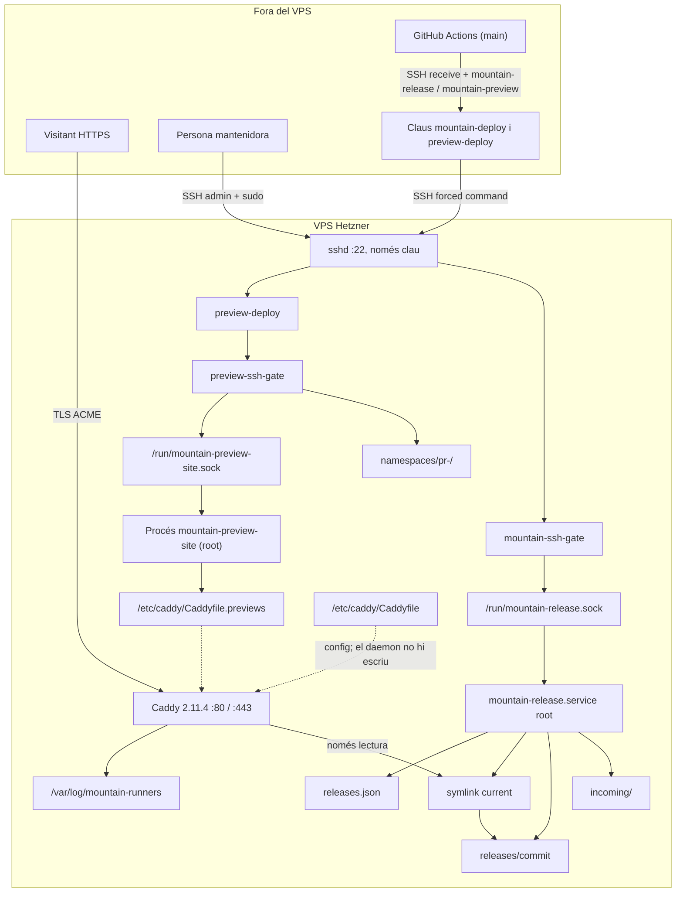

# Runbook De Producció

## Propòsit I Estat

Aquest runbook descriu l'operació mínima de producció de Mountain Runners:
servidor, TLS, logs, salut, desplegament, reversió i resposta a incidències.
Les seccions de servidor, TLS, logs, salut i reversió corresponen a la T5.3 de
[`docs/specs/phase-5-publication-operation.md`](specs/phase-5-publication-operation.md).
Les seccions de desplegament continu i workflow de rollback corresponen a la
T5.4. Les seccions de tall DNS, gate de llançament, HSTS i període
d'observació corresponen a la T5.5.

Cap acció remota (crear el VPS, registres DNS, claus SSH, secrets o activacions)
no s'executa sense l'aprovació explícita de la persona mantenidora. Cap agent,
sessió local ni assistent editorial no pot desplegar ni operar producció.

## Responsables I Canal De Vulnerabilitats

- **Persona mantenidora**: administració del VPS, aprovació del primer tall,
  rollback, revocacions, logs i resposta a incidències (T5.1).
- **Canal privat de vulnerabilitats**: Private Vulnerability Reporting de
  GitHub (`SECURITY.md`), activat i provat el 16 d'agost de 2026 (T5.1).

## 1. Servidor

### Destí

VPS de Hetzner administrat per la persona mantenidora, Debian 12 (o compatible),
amb Caddy 2.11.4 (versió pinjada i checksum SHA-512 verificat al bootstrap) com a
terminador TLS i servidor de la release activa. L'accés SSH és només amb clau
(el bootstrap desactiva l'autenticació per contrasenya); el tallafoc extern de
Hetzner només ha d'obrir 22, 80 i 443.

### Identitats

| Identitat           | Rol                                                                                                                              |
| ------------------- | -------------------------------------------------------------------------------------------------------------------------------- |
| Persona mantenidora | Usuari administratiu no `root` amb `sudo` (accés per SSH amb clau; host key verificat)                                           |
| `mountain-deploy`   | Usuari de sistema amb shell restringit (gate + `receive` a `incoming/`); clau SSH amb `command="mountain-ssh-gate"` i `restrict` |
| Daemon de releases  | Servei systemd com a `root` (`mountain-release.service`); únic escriptor de releases, registre i `current`                       |
| `preview-deploy`    | Usuari de sistema amb shell restringit (gate + `receive` de previews); clau SSH amb `command="preview-ssh-gate"` i `restrict`    |
| `caddy`             | Usuari del paquet; només llegeix la release activa i escriu els logs                                                             |

La clau de desplegament es fixa a
`/var/lib/mountain-runners/.ssh/authorized_keys` amb `restrict`, sense PTY ni
forwarding. La identitat de desplegament no té cap accés privilegiat al
filesystem ni `sudo`: el gate tokenitza sense shell i envia la petició al daemon
per `/run/mountain-release.sock` (grup `mountain-runners`, mode 0660), que la
revalida i l'executa com a `root`. El daemon tampoc pot escriure la
configuració de Caddy, les claus TLS ni l'estat ACME.

La identitat de previews (`preview-deploy`) és compartida per totes les PR.
Quan algú usa la seva clau SSH, el servidor executa sempre la comanda forçada
`preview-ssh-gate` en lloc de la comanda demanada pel client. El programa llegeix
la petició original, rebutja les ordres no permeses i, si rep un número de PR,
opera al directori `pr-<n>` corresponent. La clau no està lligada a una sola
PR. La verificació de la signatura d'autorització i els canvis a Caddy passen
pel procés `mountain-preview-site`, mitjançant un socket local; cap credencial
DNS existeix i les releases de producció resten fora de l'abast de
`preview-deploy`.
Vegeu la secció [13](#13-previews-de-pull-request-t63).

### Arquitectura Del Servidor

Aquest diagrama és la font viva de la configuració del VPS. Actualitza'l al
mateix canvi que toqui identitats, ports, paths, Caddy, el gate, el daemon o el
flux de releases (T5.4 i T5.5 incloses).

El tallafoc de Hetzner només obre 22, 80 i 443. Caddy escolta 80/443, termina
TLS amb ACME i serveix el symlink `current`. El host de validació continua al
`Caddyfile`; l'apex i `www` s'importen de `Caddyfile.production` (actiu des
del tall). El daemon de releases no escriu Caddy, claus TLS ni estat ACME.
La identitat de previews opera directament als seus directoris per PR. El
procés `mountain-preview-site`, executat com a `root`, verifica les
autoritzacions signades i modifica el fragment Caddy de previews a través d'un
socket diferent del de releases de producció (T6.4).


```mermaid
flowchart TB
  subgraph Fora["Fora del VPS"]
    Visitant["Visitant HTTPS"]
    Mantenidora["Persona mantenidora"]
    Actions["GitHub Actions (main)"]
    DeployKey["Claus mountain-deploy i preview-deploy"]
  end

  subgraph VPS["VPS Hetzner"]
    sshd["sshd :22, només clau"]
    Caddy["Caddy 2.11.4 :80 / :443"]
    Gate["mountain-ssh-gate"]
    Daemon["mountain-release.service root"]
    PreviewGate["preview-ssh-gate"]
    PreviewIdentity["preview-deploy"]
    PreviewNamespaces["namespaces/pr-<n>/"]
    PreviewSiteSock["/run/mountain-preview-site.sock"]
    PreviewSiteProcess["Procés mountain-preview-site (root)"]
    PreviewCaddyfile["/etc/caddy/Caddyfile.previews"]
    Sock["/run/mountain-release.sock"]
    Current["symlink current"]
    Releases["releases/commit"]
    Incoming["incoming/"]
    Registry["releases.json"]
    Logs["/var/log/mountain-runners"]
    Caddyfile["/etc/caddy/Caddyfile"]
  end

  Visitant -->|"TLS ACME"| Caddy
  Caddy -->|"només lectura"| Current
  Current --> Releases
  Caddy --> Logs
  Caddyfile -.->|"config; el daemon no hi escriu"| Caddy
  Mantenidora -->|"SSH admin + sudo"| sshd
  Actions -->|"SSH receive + mountain-release / mountain-preview"| DeployKey
  DeployKey -->|"SSH forced command"| sshd
  sshd --> Gate
  sshd --> PreviewIdentity
  Gate --> Sock
  Sock --> Daemon
  Daemon --> Incoming
  Daemon --> Releases
  Daemon --> Current
  Daemon --> Registry
  PreviewIdentity --> PreviewGate
  PreviewGate --> PreviewNamespaces
  PreviewGate --> PreviewSiteSock
  PreviewSiteSock --> PreviewSiteProcess
  PreviewSiteProcess --> PreviewCaddyfile
  PreviewCaddyfile -.-> Caddy
```

Operació d'una release (instal·lar o activar) des de la identitat de
desplegament:

```mermaid
sequenceDiagram
  participant Deploy as Clau mountain-deploy
  participant Gate as mountain-ssh-gate
  participant Daemon as mountain-release
  participant FS as /var/lib/mountain-runners
  participant Caddy as Caddy

  Deploy->>Gate: SSH receive (stdin) / mountain-release
  Note over Gate: tokenitza sense shell; receive escriu incoming/
  Gate->>Daemon: Unix socket
  Note over Daemon: revalida arguments com a root
  Daemon->>FS: install / activate / rollback / revoke
  Caddy->>FS: serveix current
```

Operació d'una preview (receive → install → authorize → site-enable → activate)
des de la identitat de
previews:

```mermaid
sequenceDiagram
  participant Preview as Clau preview-deploy
  participant Gate as preview-ssh-gate
  participant NS as namespaces/pr-<n>/
  participant Process as Procés mountain-preview-site (root)
  participant Caddy as Caddy (T6.4)

  Preview->>Gate: SSH receive (stdin) / mountain-preview
  Note over Gate: tokenitza sense shell; validació i namespace per PR
  Gate->>NS: receive, install (preview-deploy)
  Gate->>Process: authorize: PR, SHA i signatura (socket)
  Process->>NS: registra l'autorització com a preview-deploy
  Gate->>Process: site-enable (socket)
  Process->>Caddy: valida config, reinicia, verifica producció i previews
  Gate->>NS: activate, health, prune (preview-deploy)
  Note over NS: registre i symlink per namespace; mai toca /var/lib/mountain-runners
  Caddy->>NS: serveix els orígens actius (blocs de previews, T6.4)
```

### Estructura

```text
/var/lib/mountain-runners/         755  root:root; ACL preview-deploy:---
├── releases/<commit>/             755  root:root (una release per commit)
├── incoming/                      2770 root:mountain-runners (uploads)
├── current                        symlink atòmic a la release activa (root)
├── releases.json                  600  root:root (registre permanent)
└── .ssh/authorized_keys           644  root:root (llegible per sshd-session)
/var/lib/mountain-runners-previews/ 755  root:root
├── namespaces/                    755  preview-deploy:preview-deploy
│   └── pr-<n>/                    namespace per PR (creació del gate)
│       ├── releases/<commit>/     builds extraïts i verificats
│       ├── incoming/              uploads en staging
│       ├── current                symlink atòmic al build actiu
│       └── releases.json          registre del namespace
└── .ssh/authorized_keys           644  root:root (clau preview-deploy)
/var/log/mountain-runners/         700  caddy:caddy (accés només via sudo)
/run/mountain-release.sock         660  root:mountain-runners (socket del daemon)
/usr/local/lib/mountain-runners/        eines de release planes + preview/ i release -> .
```

### Bootstrap (només provisió inicial d'un VPS nou)

El bootstrap complet només s'executa en un VPS nou, amb aprovació prèvia i el
registre DNS del host de validació apuntant al VPS. **No el tornis a executar
contra el VPS actiu per instal·lar o actualitzar les previews**: reescriu
`/etc/caddy/Caddyfile` i `Caddyfile.production`, reinicia els serveis de
releases i Caddy, i pot tornar a deixar comentat l'import de la configuració de
producció. Executar com a `root` des del checkout del repositori només durant
la provisió inicial:

```sh
VALIDATION_HOST=validate.mountainrunners.cat \
DEPLOY_PUBLIC_KEY="ssh-ed25519 AAAA... deploy@ci" \
PREVIEW_PUBLIC_KEY="ssh-ed25519 AAAA... preview@ci" \
./tools/server/bootstrap/bootstrap.sh
```

El bootstrap és reproduïble i idempotent: instal·la Caddy pinjat amb checksum
SHA-512 verificat (`checksums.txt` oficial), crea les identitats (desplegament
i previews), el layout, els namespaces de previews, els directoris de logs, un
drop-in systemd perquè Caddy pugui escriure `/var/log/mountain-runners`, la
configuració de Caddy validada, el servei del daemon de releases i les eines.
Si no es passa cap clau pública, la identitat corresponent s'afegeix després
manualment amb les mateixes opcions de forced command.

### Instal·lació De T6.3 En Un VPS Ja Actiu (preview-only)

La instal·lació s'ha de fer per una persona mantenidora, des d'un checkout
revisat de la branca desplegada. No executis `bootstrap.sh` ni cap ordre de
`tools/deploy/`. El gate reutilitza les eines de release planes mitjançant un
symlink root-owned `release -> .`, sense duplicar mòduls. No substitueixis un
directori o symlink `release` existent: atura't i revisa'l abans de migrar.

```sh
REPO=/path/to/reviewed/mountain_runners
LIB=/usr/local/lib/mountain-runners

sudo install -d -o root -g root -m 0755 "$LIB"
if sudo test -L "$LIB/release"; then
  test "$(sudo readlink "$LIB/release")" = . || {
    echo "Unexpected release symlink; stop and inspect." >&2
    exit 1
  }
elif sudo test -e "$LIB/release"; then
  echo "Existing release path is not a symlink; stop and inspect." >&2
  exit 1
else
  sudo ln -s . "$LIB/release"
fi
sudo chown -h root:root "$LIB/release"
sudo install -d -o root -g root -m 0755 \
  "$LIB/preview" \
  "$LIB/preview/commands" \
  "$LIB/preview/commands/mountain-preview" \
  "$LIB/preview/processes" \
  "$LIB/preview/processes/mountain-preview-site" \
  "$LIB/preview/processes/preview-authorization"
sudo install -o root -g root -m 0644 \
  "$REPO/tools/server/preview/config.mjs" \
  "$REPO/tools/server/preview/authorization-proof.mjs" \
  "$LIB/preview/"
sudo install -o root -g root -m 0644 \
  "$REPO/tools/server/preview/commands/mountain-preview/cli.mjs" \
  "$REPO/tools/server/preview/commands/mountain-preview/site-request.mjs" \
  "$REPO/tools/server/preview/commands/mountain-preview/capacity.mjs" \
  "$REPO/tools/server/preview/commands/mountain-preview/inventory.mjs" \
  "$REPO/tools/server/preview/commands/mountain-preview/prune.mjs" \
  "$REPO/tools/server/preview/commands/mountain-preview/retire.mjs" \
  "$LIB/preview/commands/mountain-preview/"
sudo install -o root -g root -m 0644 \
  "$REPO/tools/server/preview/processes/mountain-preview-site/main.mjs" \
  "$REPO/tools/server/preview/processes/mountain-preview-site/caddy.mjs" \
  "$REPO/tools/server/preview/processes/mountain-preview-site/caddy-fragment.mjs" \
  "$LIB/preview/processes/mountain-preview-site/"
sudo install -o root -g root -m 0644 \
  "$REPO/tools/server/preview/processes/preview-authorization/main.mjs" \
  "$LIB/preview/processes/preview-authorization/"
sudo chmod 0755 "$LIB/preview/commands/mountain-preview/cli.mjs" "$LIB/preview/processes/mountain-preview-site/main.mjs"
sudo ln -s "$LIB/preview/commands/mountain-preview/cli.mjs" /usr/local/bin/mountain-preview
sudo ln -s "$LIB/preview/commands/mountain-preview/cli.mjs" /usr/local/bin/preview-ssh-gate
```

La identitat SSH, el shell forçat i els namespaces no es creen amb aquestes
ordres. Provisiona'ls seguint com a referència només el bloc T6.3 de
`tools/server/bootstrap/bootstrap.sh`; no executis el script. Si `preview-deploy`
ja existeix, revisa'n grup, shell, estat de contrasenya i claus abans de
modificar-ne res. No canviïs la contrasenya ni reemplaçis
`/var/lib/mountain-runners-previews/.ssh/authorized_keys`; afegeix la clau
revisada amb forced command després de revisar el fitxer existent. La identitat
no ha de pertànyer a `mountain-runners` ni accedir a
`/run/mountain-release.sock`. La configuració d'origen, TLS i Caddy continua
fora de T6.3.

### Bloqueig De Lectura De Les Releases De Producció

El bootstrap instal·la `acl` i, després de crear `preview-deploy`, afegeix una
ACL d'accés `u:preview-deploy:---` només a
`/var/lib/mountain-runners`. El directori continua amb el mateix owner, grup i
mode `0755`; Caddy i `mountain-deploy` continuen travessant-lo. L'entrada
nominal d'usuari es comprova abans de les entrades de grup, per tant també
denega accés si `preview-deploy` rep algun grup de producció per error. No
afegeixis membres a `mountain-runners` ni toquis el socket del daemon.

Per migrar un VPS existent, una persona mantenidora ha de revisar primer la
sortida actual de `getfacl -p` i comprovar que el root és `root:root 0755`.
Desa l'ACL original fora del repositori. Després que `preview-deploy` existeixi,
executa només aquesta ACL, sense `-R` i sense canviar `chmod` o grups:

```sh
RELEASE_ROOT=/var/lib/mountain-runners
sudo apt-get install acl
sudo stat -c '%U:%G %a %n' "$RELEASE_ROOT"
sudo getfacl -p "$RELEASE_ROOT"
sudo getfacl -p "$RELEASE_ROOT" > "$HOME/mountain-runners-release.acl.before-preview"
sudo -u caddy test -x "$RELEASE_ROOT"
sudo -u mountain-deploy test -x "$RELEASE_ROOT"
sudo setfacl -n -m u:preview-deploy:--- "$RELEASE_ROOT"
sudo getfacl -p "$RELEASE_ROOT"
sudo -u preview-deploy ls "$RELEASE_ROOT" >/dev/null
sudo -u preview-deploy /bin/sh -c 'cd "$1"' sh "$RELEASE_ROOT"
sudo -u caddy test -r "$RELEASE_ROOT"
sudo -u caddy test -x "$RELEASE_ROOT"
sudo -u mountain-deploy test -r "$RELEASE_ROOT"
sudo -u mountain-deploy test -x "$RELEASE_ROOT"
```

Les dues ordres com a `preview-deploy` han de fallar perquè no pot llistar ni
travessar el directori; confirma que l'error és de permisos. Les comprovacions
amb `test -r` i `test -x` poden donar falsos positius en aquest entorn i no són
prova suficient de l'aïllament.

`-n` conserva una ACL mask existent. Sense una ACL estesa prèvia, la màscara
creada és igual als permisos del grup existent (`r-x`), i la nova entrada
`---` no els amplia. Compara `getfacl` abans i després: només ha d'aparèixer
l'entrada de `preview-deploy` i, si no n'hi havia, la màscara equivalent a
`group::`. Atura't i restaura el fitxer desat si canvia qualsevol altra entrada
o fallen les comprovacions de Caddy o del desplegament:
`sudo setfacl --restore="$HOME/mountain-runners-release.acl.before-preview"`.
Després comprova `sudo mountain-release health` i el lloc públic.
L'ACL no cobreix `/etc/caddy`, claus TLS o ACME; aquestes rutes mantenen els
permisos existents.

### Verificació Del Host I Accés SSH

1. Confirmar que `https://<host de validació>` respon i que el certificat és
   vàlid.
2. Fixar la identitat del servidor: registrar el fingerprint de la clau pública
   SSH del VPS (p. ex. amb `ssh-keyscan`) a `known_hosts` de les màquines
   autoritzades i verificar-lo cada vegada que canviï.
3. Comprovar permisos: cap identitat diferent de `root` no ha de poder escriure
   `/etc/caddy/`, els certificats, l'estat ACME, `releases.json` ni el symlink
   `current`. El daemon de releases ha d'estar actiu
   (`systemctl status mountain-release`).

### Còpies De Seguretat I Restauració

Hetzner fa còpies automàtiques del disc del VPS (Backups al Cloud Console).
Aquesta és la via de recuperació si es perd el servidor; no substitueix la
reversió interna de releases.

**Abans de servir el host de validació:** activar els backups automàtics del
VPS al Cloud Console de Hetzner (retenció la que ofereixi el producte, com a
mínim una còpia diària).

**Restauració** (aprovació explícita de la persona mantenidora):

1. Al Cloud Console, crear un servidor nou a partir de l'últim backup (o
   reconstruir el VPS des del backup si Hetzner ho ofereix per a aquella
   instància). No s'editen fitxers a mà dins de les releases.
2. Verificar el fingerprint SSH nou o restablert i actualitzar `known_hosts`.
3. Comprovar `systemctl is-active caddy mountain-release`,
   `sudo mountain-release health` i
   `node tools/server/verify/verify-site.mjs --base-url https://<host> --expect-noindex`.
4. Si el backup és anterior a l'última release activa, instal·lar i activar
   l'artefacte aprovat més recent pel canal de T5.4; no reconstruir al
   servidor.

La primera restauració de prova es fa després del bootstrap del VPS, abans del
tall de producció, amb un servidor de prova o un rebuild controlat.

## 2. TLS

- Caddy emet i renova certificats automàticament (Let's Encrypt) per al host de
  validació i, després del tall, per a `mountainrunners.cat` i `www`.
- El certificat de producció només es completa quan els registres DNS apunten
  al VPS; fins llavors l'error log pot mostrar intents ACME fallits (esperat).
- **HSTS**: s'activa únicament després que el tall hagi validat TLS i tots els
  subdominis afectats, sense `includeSubDomains` (decisió T5.1). La directiva
  està comentada a `Caddyfile.production` com
  `# header Strict-Transport-Security "max-age=31536000"`; s'activa
  descomentant-la, validant amb `caddy validate`, reiniciant Caddy i
  revalidant.
- Verificació de TLS: `curl --fail https://<host>/` i comprovació de la data de
  caducitat amb `openssl s_client -servername <host> -connect <host>:443`.
- Els canvis de configuració de Caddy requereixen `systemctl restart caddy`
  (`admin off` desactiva l'API de configuració en temps d'execució).

### Redirecció De L'Arrel

El matcher `@unprefixed_root` de `(common_site)` respon a `GET /` amb una
redirecció HTTP permanent a `/ca/` abans que `file_server` serveixi
`index.html`. Només coincideix amb l'arrel, de manera que `/ca/`, `/es/`,
`/en/` i la resta de rutes publicades no canvien. L'`index.html` amb
`meta refresh` es conserva a l'artefacte com a fallback si se serveix sense
Caddy.

El desplegament de l'artefacte no actualitza Caddy. Després de fusionar el canvi,
una persona mantenidora ha d'afegir aquestes directives dins de
`(common_site)`, després dels imports de capçaleres i memòria cau, a
`/etc/caddy/Caddyfile`:

```caddyfile
@unprefixed_root path /
redir @unprefixed_root /ca/ permanent
```

Tot seguit cal validar, reiniciar i comprovar el contracte:

```sh
caddy validate --config /etc/caddy/Caddyfile --adapter caddyfile
systemctl restart caddy
node tools/server/verify/verify-site.mjs --base-url https://mountainrunners.cat --expect-indexable
```

### CSP I Analítica

La CSP vigent (T5.1 esmenada per l'[ADR 0007](decisions/0007-self-hosted-plausible-analytics.md))
viu a `tools/server/caddy/Caddyfile` dins de `(common_headers)` i s'aplica tant
al host de validació com al de producció. El desplegament de l'artefacte no
actualitza Caddy.

Per aplicar una esmena de CSP al VPS, una persona mantenidora actualitza
**només** la línia `header Content-Security-Policy` d'`/etc/caddy/Caddyfile`
perquè coincideixi amb el repositori, sense reexecutar el bootstrap (que
tornaria a comentar `import Caddyfile.production`). Després:

```sh
caddy validate --config /etc/caddy/Caddyfile --adapter caddyfile
systemctl restart caddy
node tools/server/verify/verify-site.mjs --base-url https://mountainrunners.cat --expect-indexable
```

Si l'artefacte amb l'script de Plausible es publica abans d'aquesta esmena, la
CSP anterior bloqueja l'script i les pàgines continuen navegables.

## 3. Logs

Tres registres, tots al VPS (T5.1):

| Registre | Contingut                                                  | Ubicació                                  | Retenció               |
| -------- | ---------------------------------------------------------- | ----------------------------------------- | ---------------------- |
| Access   | Temps, IP, mètode, path sense query, status, bytes, durada | `/var/log/mountain-runners/access.log`    | 7 dies, rotació diària |
| Error    | Fallades TLS/ACME i errors del servidor                    | `/var/log/mountain-runners/error.log`     | 30 dies                |
| Releases | Commit, digests, dates i estat de cada release             | `/var/lib/mountain-runners/releases.json` | Permanent              |

- La rotació és diària a mitjanit (integració de Caddy) amb compressió gzip.
- Accés exclusivament per `root` via `sudo`; cap credencial ni query string
  sensible no es registra. Caddy sempre afegeix `ts`, `level`, `logger` i
  `msg` als JSON; no es poden filtrar. La resta de camps no aprovats
  (`resp_headers`, `uri`, capçaleres, TLS, etc.) s'esborren.
- Esborrat: eliminar els fitxers de `/var/log/mountain-runners/` (la rotació
  ja n'elimina els antics segons la retenció).

## 4. Salut

Comprovacions locals (com a `root`):

```sh
sudo mountain-release health             # registre, symlink, digests
systemctl is-active mountain-release     # daemon de releases actiu
systemctl is-active caddy                # servei actiu
curl --fail https://<host>/ca/           # resposta TLS + HTTP
```

La identitat de desplegament consulta l'estat a través del gate
(`mountain-release health`), que el daemon resol com a `root`.

Comprovació remota del contracte complet (headers, 404, caché, noindex):

```sh
node tools/server/verify/verify-site.mjs --base-url https://<host> --expect-noindex
```

`mountain-release health` verifica que el registre es pot llegir, que `current`
apunta a una release registrada com a `active` i que els digests de la release
activa coincideixen amb el manifest. Un estat `DEGRADED` requereix revisió
immediata: no s'activa cap release nova fins a resoldre'l.

## 5. Releases I Reversió

### Instal·lació I Activació

L'artefacte i el manifest els genera el workflow `Artifact` (T5.2). El job de
desplegament (T5.4) els transfereix amb `mountain-release receive` a
`incoming/` i els instal·la. La persona mantenidora pot fer el mateix a mà:

```sh
sudo mountain-release install <arxiu.tar.gz> <manifest.json>
sudo mountain-release activate <commit>
```

La identitat de desplegament executa les mateixes operacions a través del gate
SSH (forçat al daemon), que tokenitza sense shell. El daemon valida tots els
arguments i no permet cap altra ordena. `install` rebutja paths absoluts,
`..`, symlinks, hardlinks, dispositius, fitxers duplicats, qualsevol tipus
inesperat i qualsevol arxiu que superi els límits aprovats (128 MiB expandits,
5.000 entrades, arxiu comprimit màxim 256 MiB); verifica tots els digests
contra el manifest i, en cas de fallada, elimina la release incompleta sense
tocar el punter actiu. `activate` canvia el symlink `current` de manera
atòmica (rename) després de verificar digests i elegibilitat.

### Reversió Rutinària (Interna)

Sense tocar DNS, s'activa la release anterior elegible més recent:

```sh
sudo mountain-release rollback            # release anterior elegible
sudo mountain-release rollback <commit>   # release elegible concreta
```

La reversió verifica elegibilitat i digests i rebutja releases revocades. Si el
workflow de desplegament ha quedat inconsistent amb el registre, `activate` és
idempotent i reconvergeix l'estat.

### Revocació

```sh
sudo mountain-release revoke <commit> --reason "vulnerabilitat X"
```

Motius aprovats: vulnerabilitat, retirada de consentiment, contingut incorrecte
o incidència legal. La release activa no es pot revocar: primer s'activa o es
reverteix a una altra. Les releases revocades no es poden reactivar mai.

### Reversió DNS Inicial (Via Extraordinària)

Si no queda cap release elegible i s'ha d'aturar el servei de la release
activa, la resposta d'emergència (secció 6) és la via prevista. La restauració
dels registres web anteriors de Hostinger queda només com a via extraordinària:
requereix l'exportació prèvia al tall (T5.5), aprovació explícita de la persona
mantenidora i no es pot executar automàticament.

## 6. Resposta D'Emergència (Sense Cap Release Elegible)

Quan `mountain-release rollback` informa que no queda cap release elegible
(codi 3), la resposta d'emergència és la següent:

1. **Registrar l'incident**: causa, releases implicades i motius de revocació
   (el registre de releases és permanent i traçable).
2. **Avaluar la release activa**: si `mountain-release health` està OK, el lloc
   continua servint la release activa; no es retira res més.
3. **Preparar una correcció pel canal aprovat**: PR revisada i fusionada a
   `main` → el workflow d'artefacte genera un artefacte nou → `install` i
   `activate`. Aquesta és l'única via de recuperació: no es reconstrueix al
   servidor, no s'editen fitxers manualment dins de la release, no es reactiva
   cap artefacte revocat i no s'altera el registre a mà.
4. **Si cal retirar la web de servei mentre es prepara la correcció**: decisió
   de la persona mantenidora amb aprovació explícita; documentar l'estat al
   registre de releases i al canal de vulnerabilitats.
5. **Via extraordinària**: la restauració dels registres web anteriors a
   Hostinger (secció 5) només s'executa amb aprovació explícita i registre de
   la decisió.

Prohibicions permanents: reconstruir al servidor, editar fitxers de la release
a mà, reactivar una release revocada i editar `releases.json` manualment.

## 7. Desplegament Continu Des De `main`

El workflow `Artifact` construeix i valida l'artefacte (T5.2) i, al mateix run,
el job `Deploy to production` transfereix **el mateix** paquet al VPS. El job
de build no té `environment` ni secrets de producció. El job de desplegament
llegeix els secrets de l'entorn `production`; el de rollback, els de
`production-rollback`.

### Entorn GitHub `production`

La persona mantenidora crea l'entorn (Settings → Environments) **abans** de la
primera activació. Configuració requerida, sense valors secrets en aquest
document:

| Control             | Valor                                                                          |
| ------------------- | ------------------------------------------------------------------------------ |
| Nom                 | `production`                                                                   |
| Deployment branches | només `main`                                                                   |
| Required reviewers  | la persona mantenidora, fins que la secció 12 registri el període d'observació |
| Wait timer          | 0                                                                              |

Variables d'entorn (Settings → Environments → `production` → Environment
variables):

| Nom                    | Contingut                                                                                         |
| ---------------------- | ------------------------------------------------------------------------------------------------- |
| `DEPLOY_HOST`          | hostname SSH del VPS (host de validació fins al tall; després pot continuar sent la IP o el host) |
| `DEPLOY_USER`          | `mountain-deploy` (opcional; aquest és el valor per defecte)                                      |
| `SMOKE_BASE_URL`       | `https://<host de validació>` fins al tall; `https://mountainrunners.cat` després                 |
| `SMOKE_EXPECT_NOINDEX` | buit o qualsevol valor distint de `false` al host de validació; `false` després del tall          |

Secrets d'entorn:

| Nom                      | Contingut                                            |
| ------------------------ | ---------------------------------------------------- |
| `DEPLOY_SSH_PRIVATE_KEY` | clau privada de la identitat `mountain-deploy`       |
| `DEPLOY_KNOWN_HOSTS`     | línia `known_hosts` amb el fingerprint SSH verificat |

Aquests secrets no es comparteixen amb previews (fase 6) ni amb el job de
build. El workflow no desplega des de forks ni des de branques diferents de
`main`.

Després del tall públic (19 d'agost de 2026) els valors vigents són
`SMOKE_BASE_URL=https://mountainrunners.cat` i
`SMOKE_EXPECT_NOINDEX=false`.

### Entorn GitHub `production-rollback`

El workflow `Rollback production` usa un entorn **separat** perquè, un cop
retirats els required reviewers de `production`, la reversió continuï
exigint aprovació humana (spec T5.5).

| Control             | Valor                                         |
| ------------------- | --------------------------------------------- |
| Nom                 | `production-rollback`                         |
| Deployment branches | només `main`                                  |
| Required reviewers  | la persona mantenidora; **no es retiren mai** |
| Wait timer          | 0                                             |

La persona mantenidora crea aquest entorn **abans** que s'executi el
workflow `Rollback production` amb aquest nom. Si el nom no existeix, GitHub
el crea sense regles de protecció ni secrets. Cal copiar els **mateixos noms**
de variables i secrets que `production` (`DEPLOY_HOST`, `DEPLOY_USER`,
`SMOKE_BASE_URL`, `SMOKE_EXPECT_NOINDEX`, `DEPLOY_SSH_PRIVATE_KEY`,
`DEPLOY_KNOWN_HOSTS`). Els valors no es documenten. Cap agent no crea
l'entorn ni hi enganxa secrets.

La primera execució queda a l'espera de l'aprovació de l'entorn. No s'aprova
fins que el VPS estigui bootstrapjat, la clau de desplegament instal·lada i el
host de validació resolgui. Cap agent ni sessió local no configura l'entorn ni
n'aprova el desplegament.

### Flux

1. Push (o `workflow_dispatch`) a `main` → jobs `build` i `reproducibility`
   sense secrets.
2. El job `deploy` espera l'aprovació de `production` i ocupa el grup de
   concurrència `production-release` (`cancel-in-progress: false`).
3. `tools/deploy/deploy.mjs` comprova que `github.sha` encara és el HEAD de
   `main`; si no, rebutja l'execució (no és una reversió).
4. Verifica el manifest i l'arxiu localment (commit, origen, llista de
   fitxers).
5. Transfereix l'arxiu i el manifest amb `mountain-release receive` (stdin
   per SSH; `restrict` impedeix scp/sftp) i comprova el SHA-256 retornat.
6. `install` (extracció segura al servidor) i, immediatament abans d'activar,
   torna a comprovar el HEAD de `main`.
7. Llegeix el commit actiu actual i fa `activate` (symlink atòmic). Una
   fallada abans d'aquest pas no mou el punter actiu.
8. Torna a comprovar el HEAD de `main`, després `health` i smoke tests
   (`tools/server/verify/verify-site.mjs` amb `--expect-noindex` mentre el
   host de validació és el destí, o `--expect-indexable` quan
   `SMOKE_EXPECT_NOINDEX` és `false`). Si fallen, restaura el commit que era
   actiu abans d'aquest `activate` (no un `rollback` genèric). Si no n'hi
   havia cap, registra la resposta d'emergència (secció 6) i falla.

Reexecutar el mateix commit és idempotent: si la release ja és activa, el job
només revalida salut i smoke.

### Smoke Tests

L'apex ja és públic. El smoke de CI usa `SMOKE_BASE_URL=https://mountainrunners.cat`
i `SMOKE_EXPECT_NOINDEX=false`, que afegeix `--expect-indexable` i comprova la
redirecció `www` → apex. El valor buit o distint de `false` continuaria
afegint `--expect-noindex` (host de validació).

```sh
# Host de validació
node tools/server/verify/verify-site.mjs \
  --base-url "$SMOKE_BASE_URL" \
  --expect-noindex

# Apex, després del tall
node tools/server/verify/verify-site.mjs \
  --base-url https://mountainrunners.cat \
  --expect-indexable
```

## 8. Reversió Des Del Workflow

El workflow `Rollback production` (`.github/workflows/rollback.yml`) és
`workflow_dispatch` sobre `main`, amb l'entorn `production-rollback` (required
reviewers permanents) i el mateix grup de concurrència `production-release`.
No reconstrueix. L'input opcional `commit` ha de ser un SHA-1 de 40 caràcters
d'una release **elegible**; buit selecciona la release elegible anterior.

Una execució retardada del workflow `Artifact` d'un commit antic **no** és una
reversió: es rebutja al pas 3 de la secció 7. Només aquest workflow (o
`sudo mountain-release rollback` al servidor) pot moure el punter enrere.

Després d'activar, executa els mateixos smoke tests. Si fallen, restaura el
commit que era actiu abans d'aquest rollback. Una release revocada és
rebutjada pel daemon.

## 9. Tall DNS I Primera Activació Pública

El 19 d'agost de 2026 l'apex i `www` ja serveixen des del VPS. Aquesta secció
registra el procediment aplicat i l'ordre correcte per reproduir-lo; **no** es
tornen a canviar els registres web ni Caddy sense aprovació explícita.

Cap pas d'aquesta secció s'executa des d'una sessió d'agent. El tall no migra
nameservers, no activa DNSSEC i no publica IPv6.

L'inventari públic vigent és a
[`docs/phase-5-t55-dns-inventory.md`](phase-5-t55-dns-inventory.md). La
checklist d'evidència del gate és a
[`docs/validation/phase-5-t55-launch-gate.md`](validation/phase-5-t55-launch-gate.md).

### Condicions Prèvies

- Canal privat de vulnerabilitats operatiu (T5.1).
- Polítiques públiques de privacitat i cookies coherents amb Hetzner, YouTube
  i els logs (T5.3).
- VPS bootstrapjat, host de validació amb TLS i `X-Robots-Tag: noindex`,
  identitat `mountain-deploy` instal·lada.
- Entorn GitHub `production` creat, amb required reviewers, i almenys una
  release elegible activada al host de validació (T5.4).
- Correu a Hostinger: iniciar sessió a
  [`https://mail.hostinger.com`](https://mail.hostinger.com) amb l'adreça
  institucional completa (no amb la contrasenya del hPanel). A l'allotjament
  actual `https://mountainrunners.cat/webmail` ja respon 404; el tall no hi
  canvia res.
- Còpia de seguretat del VPS activa al Cloud Console de Hetzner.

### Export I TTL

1. Exportar l'inventari des de hPanel (captures o CSV) i anotar els valors
   públics amb `dig`:

   ```sh
   dig +short NS mountainrunners.cat
   dig +short MX mountainrunners.cat
   dig +short TXT mountainrunners.cat
   dig +short TXT _dmarc.mountainrunners.cat
   dig +short TXT default._domainkey.mountainrunners.cat
   dig +short TXT hostinger._domainkey.mountainrunners.cat
   dig +short A mail.mountainrunners.cat
   dig +short CNAME mail.mountainrunners.cat
   dig +short CNAME autodiscover.mountainrunners.cat
   dig +short CNAME autoconfig.mountainrunners.cat
   dig +short A ftp.mountainrunners.cat
   dig +short A mountainrunners.cat
   dig +short AAAA mountainrunners.cat
   dig +short CNAME www.mountainrunners.cat
   dig +short A www.mountainrunners.cat
   dig +short AAAA www.mountainrunners.cat
   ```

   Conservar l'export de hPanel fora del repositori fins que acabi el període
   d'observació. És la base de la via extraordinària de restauració DNS.

2. Reduir el TTL de l'apex i `www` al mínim que permeti Hostinger (el SOA
   actual té mínim 600 s) i esperar com a mínim aquest TTL abans del canvi.
3. No tocar MX, SPF, DKIM, DMARC, `mail`, `autodiscover`, `autoconfig`,
   `ftp`, NS ni cap altre registre que no sigui l'A/AAAA/CNAME de l'apex i
   `www`. Confirmar al hPanel si existeix un selector DKIM fora de
   `default` i `hostinger`.

### Activar El Host De Producció A Caddy

**Abans** de moure l'A de l'apex i `www`, al servidor (com a `root`):
descomentar `import Caddyfile.production` a `/etc/caddy/Caddyfile` i:

```sh
caddy validate --config /etc/caddy/Caddyfile --adapter caddyfile
systemctl restart caddy
```

Caddy emetrà certificats per a `mountainrunners.cat` i `www` via ACME. Els
intents fallits a `error.log` abans que el DNS hagi propagat són esperats.

### Canvis Web A Hostinger

Només després que Caddy tingui el bloc de producció actiu, aquests registres,
amb la IPv4 pública del VPS (`APEX_IPV4`):

| Nom         | Abans (Hostinger)                       | Després             |
| ----------- | --------------------------------------- | ------------------- |
| A `@`       | les dues IPv4 de Hostinger              | una A a `APEX_IPV4` |
| AAAA `@`    | les IPv6 de Hostinger                   | **esborrar**        |
| CNAME `www` | `www.mountainrunners.cat.cdn.hstgr.net` | **esborrar**        |
| A `www`     | (via CNAME)                             | una A a `APEX_IPV4` |
| AAAA `www`  | (via CNAME)                             | **esborrar**        |

No es publica cap `AAAA` fins que IPv6, el tallafoc, Caddy i els smoke tests
funcionin també per IPv6. Llavors es torna a comprovar amb `dig +short AAAA`.

### Verificar El Tall

Repetir els `dig` de correu (MX, TXT, DKIM, `mail`, autodiscover, autoconfig)
i comprovar que coincideixen amb l'export previ. Els A d'apex i `www` han de
ser només `$APEX_IPV4`; no ha de quedar CNAME de `www` ni AAAA d'apex o `www`.
`mail` ha de continuar sense registre nou.

```sh
node tools/server/verify/verify-site.mjs \
  --base-url https://mountainrunners.cat \
  --expect-indexable
```

Comprovar el correu: enviar i rebre un missatge a l'adreça institucional, i
obrir [`https://mail.hostinger.com`](https://mail.hostinger.com) amb la
mateixa bústia. MX, SPF, DKIM i DMARC no han d'haver canviat.

### Variables De L'Entorn Després Del Tall

A Settings → Environments → `production` i, amb els mateixos noms, a
`production-rollback`:

| Nom                    | Valor nou                     |
| ---------------------- | ----------------------------- |
| `SMOKE_BASE_URL`       | `https://mountainrunners.cat` |
| `SMOKE_EXPECT_NOINDEX` | `false`                       |

Aquests valors ja corresponen a l'apex en servei. Els required reviewers de
`production` es mantenen fins a la secció 12. `production-rollback` els
conserva sempre.

## 10. Gate De Llançament

Abans de donar el tall per acceptat, la persona mantenidora completa
[`docs/validation/phase-5-t55-launch-gate.md`](validation/phase-5-t55-launch-gate.md):

- `pnpm validate` sobre el commit desplegat (ja és gate de CI a `main`).
- `pnpm lighthouse` contra el build local, dins dels llindars aprovats.
- Navegació representativa `ca` / `es` / `en` (portada, hub, un detall, 404).
- Revisió manual d'accessibilitat de llançament; axe no equival a WCAG 2.2 AA.
- TLS a l'apex i `www`, redirecció HTTP→HTTPS, smoke `--expect-indexable`.
- `sudo mountain-release health` i comprovació dels logs d'accés i d'error
  (camps i rotació de T5.1, sense query string ni secrets).
- Correu i webmail a `https://mail.hostinger.com`.
- Reversió interna: `Rollback production` (o `sudo mountain-release rollback`)
  cap a una release anterior elegible, smoke, i reactivació de la release
  desitjada. El workflow ha d'usar l'entorn `production-rollback`.

## 11. HSTS

HSTS no s'activa al mateix moment que el tall. Després que TLS, apex, `www` i
els smoke tests siguin estables, descomentar a
`/etc/caddy/Caddyfile.production`:

```text
header Strict-Transport-Security "max-age=31536000"
```

sense `includeSubDomains` (T5.1). Validar, `systemctl restart caddy` i
reexecutar:

```sh
node tools/server/verify/verify-site.mjs \
  --base-url https://mountainrunners.cat \
  --expect-indexable \
  --expect-hsts
```

## 12. Període D'Observació I Retirada Del Gate

El període d'observació aprovat és **48 hores** després d'un tall amb smoke,
correu i TLS estables. L'apex ja és públic; el rellotge corre des d'aquest
tall.

Durant aquest període:

- Cada merge a `main` continua desplegant-se només amb aprovació de l'entorn
  `production`.
- El workflow `Rollback production` continua protegit per
  `production-rollback`.
- No es rebaixa la protecció de `main` ni els checks obligatoris.

Abans de retirar el gate de deploy, la persona mantenidora crea
`production-rollback` (si encara no existeix), hi copia variables i secrets
i hi deixa required reviewers.

Quan confirma les 48 hores sense incidència de tall, correu o TLS:

1. Retira **Required reviewers** només de l'entorn GitHub `production`. Els
   merges posteriors a `main` poden activar-se automàticament si passen els
   gates.
2. No toca els required reviewers de `production-rollback`.
3. Registra la data a
   [`docs/validation/phase-5-t55-launch-gate.md`](validation/phase-5-t55-launch-gate.md).

Cap agent no configura els entorns ni n'elimina els reviewers.

## 13. Previews De Pull Request (T6.3)

Les previews de PR (fase 6, decisió T6.2 esmenada per l'ADR 0010) les serveix
Caddy al mateix VPS que producció, amb blocs i registres d'accés separats però
emmagatzematge ACME compartit. El DNS és un wildcard manual
(`*.preview.mountainrunners.cat` → aquest VPS) i cap
sistema de previews té credencials DNS. La T6.3 implementa la frontera entre
el build no fiable i el publicador de confiança. Els noms de la comanda, el
procés i el directori per PR es defineixen a
[`docs/deployment.md`](deployment.md#noms-del-flux-de-previews).

### Usuari i directori de previews

| Element          | Què és                                                                                                                      |
| ---------------- | --------------------------------------------------------------------------------------------------------------------------- |
| `preview-deploy` | Usuari de sistema amb accés SSH limitat a la comanda `preview-ssh-gate`; clau amb `command="preview-ssh-gate"` i `restrict` |
| Directori per PR | `/var/lib/mountain-runners-previews/namespaces/pr-<n>/`; tots comparteixen l'usuari `preview-deploy`                        |

La identitat de previews executa les operacions de releases directament com a
`preview-deploy`. És propietària de `namespaces/` i dels directoris de totes
les PR que hi crea; no hi ha comptes ni permisos independents per PR.
L'autorització signada i els canvis dels blocs Caddy passen pel procés
`mountain-preview-site` mitjançant un socket restringit al grup de previews.
L'ACL `u:preview-deploy:---` a
`/var/lib/mountain-runners` impedeix llegir i travessar
les releases de producció, tot i que el mode UNIX segueix sent `0755` perquè
Caddy i `mountain-deploy` conservin l'accés existent. La identitat no pot
escriure a `/etc/caddy`, les claus TLS o l'estat ACME, i no pertany al grup
`mountain-runners`. No li concedeixis accés a `/run/mountain-release.sock` ni
afegeixis-la a grups de producció.

### Publicar una preview

Res no es construeix ni es publica perquè s'obri o s'actualitzi una PR: el
workflow `Preview` només corre sota demanda.

1. Una persona col·laboradora amb permisos demana la preview amb un
   **comentari a la PR amb el text exacte `/preview`** (per exemple, via
   `gh pr comment <n> --body "/preview"`, també des d'un agent). També hi ha
   via manual: `Preview` (workflow_dispatch amb el número de PR).
2. El job `authorize` (codi de confiança des de la branca per defecte)
   comprova els permisos de qui l'ha demanada i identifica el commit vigent de
   la PR pel seu SHA. La petició queda vinculada a aquest commit, no a tots els
   futurs canvis de la PR.
3. El job `build` (no fiable, sense secrets ni caches) fa checkout del commit
   vigent de la PR, executa `pnpm validate` complet i compila l'artefacte amb
   l'origen `pr-<n>.preview.mountainrunners.cat`; el job `publish` valida manifest,
   mida, fitxers, digests i paths amb els validadors de producció i
   revalida que la PR continua oberta i al mateix commit i que l'autorització
   encara és vigent (col·laboradora per a `/preview` o permís d'escriptura per
   a `workflow_dispatch`). El publicador signa l'autorització amb la clau
   privada exclusiva del job de confiança. El procés `mountain-preview-site`
   verifica la signatura amb la clau pública del VPS abans de registrar-la.
   La clau SSH de previews per si sola no pot autoritzar una release. El
   procés valida el Caddyfile abans de reiniciar Caddy per configurar l'origen.
   El publicador torna a comprovar la PR i l'autorització just abans d'activar
   la versió instal·lada al directori de la PR.
4. Verificació posterior a l'activació:

   ```sh
   sudo mountain-preview list <n>     # registre del namespace
   sudo mountain-preview health <n>   # registre + digests del build actiu
   ```

   Els orígens TLS i les capçaleres de no-producció es comproven a la T6.4 i
   la T6.5, quan els blocs Caddy de previews estiguin actius.

5. La retirada (tancament, fusió, revocació, caducitat i reconciliació
   d'orfes) és la T6.4; mentre el sistema no estigui validat, no es publica
   cap preview.

La T6.4 afegeix `mountain-preview retire <n>`: despublica l'origen canviant
atòmicament el nom del namespace i després n'esborra les releases. Repetir-lo
quan el namespace ja no existeix no falla. És una primitiva local: fins que la
reconciliació i la retirada automatitzada no estiguin verificades, no s'ha
d'activar cap preview. La instal·lació de la primitiva al VPS requereix una
aprovació explícita separada.

El workflow `Preview cleanup` reconcilia cada hora i en tancar una PR. Retira
previews tancades, de forks, amb SHA antic o que portin 14 dies sense
actualitzar-se. Els fitxers rebuts però no instal·lats caduquen al cap d'un
dia. `mountain-preview site-sync` elimina blocs Caddy sense versió activa i
`mountain-preview prune <n>` esborra versions anteriors i fitxers rebuts ja
utilitzats. Si `current` i el registre no concorden, la reconciliació
retira la preview afectada, continua amb les altres i falla el job perquè se'n
revisi la causa. També elimina directoris de retirades interrompudes. La
comanda `mountain-preview` rebutja un sisè origen actiu. La marca visual
`PUBLIC_PREVIEW` és part del build i una PR maliciosa la pot ocultar (esmena
de l'ADR 0009): cal revisar el contingut abans d'autoritzar-lo.

Per revocar immediatament una preview d'una PR oberta, la persona mantenidora
afegeix l'etiqueta `preview-revoked` a GitHub. El workflow de neteja reacciona
a l'esdeveniment i la reconciliació horària ho torna a comprovar; el publicador
rebutja qualsevol nova activació mentre l'etiqueta hi sigui. Per reprendre la
publicació cal retirar l'etiqueta i tornar a autoritzar el SHA vigent amb
`/preview`. Si GitHub o el workflow fallen, cal suspendre les previews i
executar la retirada pel canal administratiu aprovat; no editar releases a mà.

### Instal·lació de T6.4 al VPS existent (només amb aprovació)

La persona mantenidora instal·la els mòduls nous de `tools/server/preview/`
com a `root:root` a `/usr/local/lib/mountain-runners/preview/`, conservant les
subcarpetes `commands/mountain-preview/`, `processes/mountain-preview-site/` i
`processes/preview-authorization/`, i el servei
`tools/server/systemd/mountain-preview-site.service` a
`/etc/systemd/system/`, substituint el GID `0` de la plantilla pel GID real
del grup `preview-deploy` i l'UID `0` per l'UID de l'usuari `preview-deploy`.
Si ja hi ha una instal·lació de T6.3, la persona mantenidora actualitza els
enllaços `/usr/local/bin/mountain-preview` i `/usr/local/bin/preview-ssh-gate`
perquè tots dos apuntin a
`/usr/local/lib/mountain-runners/preview/commands/mountain-preview/cli.mjs`.
Comprova també que la unitat `mountain-preview-site.service` engega
`/usr/local/lib/mountain-runners/preview/processes/mountain-preview-site/main.mjs` abans de
reprendre cap publicació; els fitxers antics al directori `preview/` no són els
punts d'entrada nous.
Instal·la la clau pública de signatura a
`/etc/mountain-runners/preview-auth.pub` com a `root:root` mode `0644`, i
configura `PREVIEW_AUTH_PRIVATE_KEY` només com a secret de l'entorn GitHub
`previews`; la clau privada no s'instal·la al VPS ni es desa al repositori.
La persona mantenidora genera el parell fora del repositori i comprova que
el procés `mountain-preview-site` rebutja una signatura absent o invàlida
abans de publicar res.
Crea `/var/log/mountain-runners-previews/` com a
`caddy:caddy` mode `0700` amb `access.log` com a `caddy:caddy` mode `0600`
abans de validar Caddy. Instal·la el drop-in revisat
`tools/server/systemd/caddy-mountain-runners.conf`, que autoritza aquesta
ruta de logs al sandbox de Caddy, i `/etc/caddy/Caddyfile.previews` buit com a
`root:root` mode `0644`. Afegeix només `import Caddyfile.previews` al final del
`Caddyfile` vigent i instal·la `tools/server/caddy/preview-robots/robots.txt`
a `/etc/caddy/preview-robots/robots.txt` com a `root:root` mode `0644`.
No substitueix els blocs de producció ni toca les seves credencials; no
reexecuta el bootstrap sobre el VPS actiu.
Valida **tot** `/etc/caddy/Caddyfile` abans de reiniciar Caddy; després
comprova producció. Recarrega systemd i activa el servei
`mountain-preview-site`, que executa el procés com a `root`, amb el
socket `/run/mountain-preview-site.sock` mode `0660`, grup `preview-deploy`.
La unitat manté `/var/lib` en mode només lectura excepte
`/var/lib/mountain-runners-previews/namespaces`: el procés fill
`preview-authorization` necessita escriure el registre i el fitxer de bloqueig
d'una PR com a `preview-deploy`. Durant les proves de la T6.5, comprova amb
una autorització signada que el registre de la PR s'actualitza sota el servei
real de `systemd`; els tests locals no reprodueixen aquest sandbox. Si falla,
no activis les previews.
No obre el sistema a previews de revisió fins que la prova TLS contra l'staging
de Let's Encrypt, la retirada, la reconciliació, els logs i els smoke tests de
la T6.5 passin. La primera preview de prova requereix aprovació explícita i
retirada immediata en acabar la validació.
Si falla la validació, restaura la configuració anterior i no reinicia Caddy.
Si falla el reinici o el smoke de producció, restaura el fragment anterior,
reinicia i suspèn les previews; no edita cap release de producció.

L'entorn GitHub `previews` només separa els secrets de producció: no té
required reviewers, perquè l'autorització és el comentari verificat. Els
secrets de previews (`PREVIEW_SSH_PRIVATE_KEY`, `PREVIEW_KNOWN_HOSTS`,
`PREVIEW_AUTH_PRIVATE_KEY`) viuen
només a l'entorn `previews`, mai compartits amb producció. El risc residual
acceptat: qualsevol col·laborador del repositori pot sol·licitar la
publicació d'una PR pròpia amb `/preview`; el publicador continua rebutjant
forks, PRs tancades i caps mouments.

Els canvis de Caddy dels previews requereixen validació completa abans de
reiniciar i comprovació de producció després. Els blocs de lloc i els logs
estan separats, però el procés i el magatzem ACME són compartits; una fallada
del procés, del magatzem o del reinici pot afectar producció. Si passa, cal
aturar l'activació de previews i revisar l'ADR 0010. El DNS de producció i
les credencials de desplegament continuen fora de l'abast dels previews.
